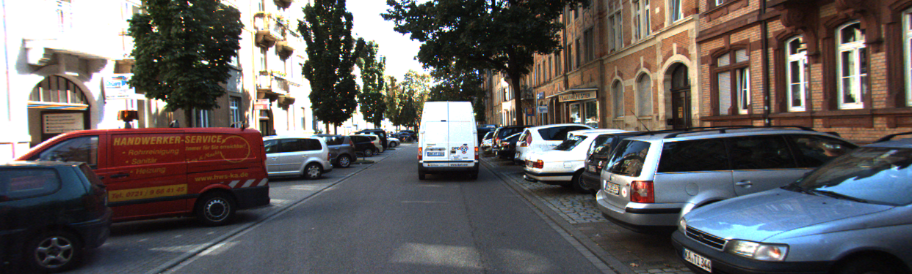
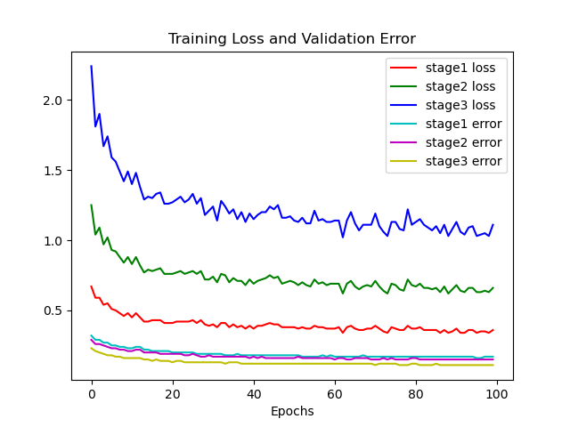
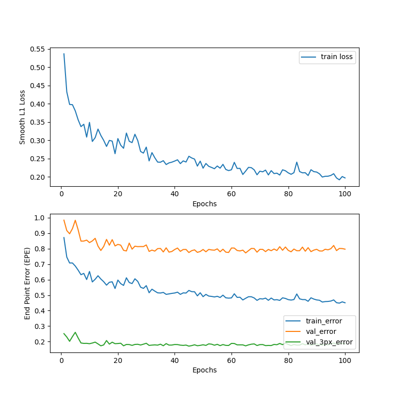

# Bi3D Stereo Depth Estimation
This work was done for Santa Clara University's Deep Learning course taught by Professor Anastasiu <br/> 

## Introduction

This repository serves as an evaluation and analysis of a state-of-the-art stereo-based depth estimation algorithm called **[Bi3D](https://arxiv.org/abs/2005.07274)**. Bi3D was evaluated against two other state-of-the-art stereo-based depth estimation algorithms, **[AnyNet](https://arxiv.org/abs/1810.11408)** and **[LEAStereo](https://arxiv.org/abs/2010.13501)**. 

Both these models were fine-tuned on the KITTI Stereo Evaluation 2015 dataset using weights that had already been trained with SceneFlow. The comparison metrics employed were *inference time* and *three pixel error*. **We confirmed that for binary classification, Bi3D is indeed faster than both AnyNet and LEAStereo. We also showed that Bi3D had the highest three-pixel error.**

Bi3D original implementation found **[here](https://github.com/NVlabs/Bi3D)**

AnyNet original implementation found **[here](https://github.com/mileyan/AnyNet)**

LEAStereo original implementation found **[here](https://github.com/XuelianCheng/LEAStereo)**

## Problem Statement
State of the art stereo-based depth estimation algorithms compute depth by testing a number of candidate disparities and then selecting the most likely under some cost function. Therefore, in order to calculate the disparity for each pixel, a continuous depth map needs to be generated. For real-time applications such as autonomous navigation, however, it may be useful to trade accuracy for lower latency. Bi3D presents a method that estimates depth via a series of binary classifications. Rather than testing if objects are at a particular depth D, it classifies them as being closer or farther than D. Bi3D also boasts the ability to estimate depth with arbitrarily coarse quantization, produce quantized levels within a target depth range, or generate a continuous depth map. This fine-grained control is the core strength of Bi3D, allowing one to determine the optimal computation based on the accuracy and time budget allotted.

## Bi3D algorithm
*The following is a brief description of the algorithm, summarized from the [original paper](https://arxiv.org/abs/2005.07274)*

Given two input images and a plane sweep volume built using a range of disparity values that are given as max and min hyperparameters we first perform a homography over a plane generated over a single disparity value from the PSV. The homography, often called warping, generates disparity vectors for pixels or objects of interest in the scene based on some cost matching function. At this step we perform disparity regression and the output of the network is the disparity vectors over the disparities that are in the interval [disparity_min, disparity_max]. This is the general pipeline of existing algorithms but there are two main changes that take place in order to generate binary disparity maps. First we do not need to consider the disparity magnitude when doing binary depth estimation. When two disparity vectors have opposite directions, they are considered to be on opposite sides of the disparity plane therefore doing regression on disparity vectors is redundant for binary depth maps. Second, the range of disparity values that we consider in Bi3D are discrete as compared to existing implementations. In other words, we no longer test disparities in the range [disparity_min, disparity_max] but the disparity values [d0, d1, … , dn]. This significantly reduces the search space and therefore the speed at which the algorithm is able to do inferences. For quantized depth estimation they simply concatenate the results of several binary depth estimations. Similarly for selective depth they consider depth in a smaller interval still using fixed discrete values. Lastly, because they are doing a binary classification the output of the network is no longer parameterized by the cost of matching disparity vectors but a confidence map of the pixels for a disparity plane d_i. The confidence map remaps the pixels into the range [0,1] and tells us the probability that a pixel is in front or behind a plane generated by the PSV. 

## LEAStereo
*The following is a brief description of the algorithm, summarized from the [original paper](https://arxiv.org/abs/2010.13501)*

This model is based on a paradigm called Neural Architecture Search (NAS) which is a technique for automating the design of artificial neural networks. The algorithm iteratively searches for the best architecture by using tiny network topologies that are sequentially stacked on top of each other. Typically the search space for these types of designs can be extremely large but the authors leveraged the success of known stereo architectures to drastically shrink the search space. The model is a volumetric end to end design with approximately 1.81M parameters. As a result, only the Feature Net and Matching Net could be learned. See Figure 9 below for the pipelined structure. 

## AnyNet
*The following is a brief description of the algorithm, summarized from the [original paper](https://arxiv.org/abs/1810.11408)*

The principal contribution of AnyNet is the model size as compared to Bi3D. Because AnyNet uses only 36K parameters it can be used in situations where the computational budget is small which includes mobile devices but it is not limited to that scope as it can also be used on embedded devices. The general operation stack is similar to existing implementations where they run a feature extraction network on images of significantly downscaled resolutions and perform disparity regression to generate a continuous depth map. The lower-level features are combined as residuals with upscaled images that have more feature levels. The novel thing about this network is that we don’t require the network to finish all stages of refinement before we can make inferences therefore depending on our use case we can use a lower resolution depth map if accuracy is not critical.   

## Datasets

Due to GitHub size limitations, this repo *does not* contain the following datasets. These must be downloaded separately. 

### **[SceneFlow](https://lmb.informatik.uni-freiburg.de/resources/datasets/SceneFlowDatasets.en.html)**
First introduced in a CVPR 2016 paper titled *[A Large Dataset to Train Convolutional Networks for Disparity, Optical Flow, and Scene Flow Estimation](https://arxiv.org/abs/1512.02134)*, the dataset contains more than 39k stereo frames in 960x540 pixel resolution, rendered from various synthetic sequences. 

<p align="center">
  
</p>
<p align="center">
  Example image from SceneFlow dataset
</p>

### **[KITTI Stereo Evaluation 2015](http://www.cvlibs.net/datasets/kitti/eval_scene_flow.php?benchmark=stereo)**

Created by the Karlsruhe Institute of Technology and Toyota Technological Institute at Chicago, the KITTI dataset serves as a novel challenging real-world computer vision benchmark. This dataset consists of 200 training scenes and 200 test scenes captured from an autonomous driving platform. The ground truth disparity has been taken from a Velodyne laser scanner.
<p align="center">
  
</p>
<p align="center">
  Example image from KITTI dataset
</p>

## Performance Metrics
END POINT ERROR (EPE) 

This metric is the mean L1 loss between the ground truth disparity and the predicted disparity for each pixel. It is well regarded as the standard for the SceneFlow dataset.
<p align="center">
  
</p>

THREE-PIXEL ERROR (%) 

Since the KITTI dataset are real-world photos, they can contain a fair amount of noise, resulting in a standard metric like EPE to have high variance. This can often mislead a neural network that is using this within its cost function so a more appropriate measure of performance is needed. The KITTI administrators introduced “three-pixel error” which is a percentage of the disparity outliers in the entire prediction. A prediction is considered erroneous if its EPE is greater than 3 pixels and the distance between predicted point and the true end point is larger than 5% of the length of the true flow vector. These additional considerations help stabilize the metric and have been shown to produce better results than using raw EPE.  

INFERENCE TIME

The last metric used by Bi3D is the algorithm runtime measured in seconds and frames per second (FPS). Since latency is the cornerstone of this method, computation time is imperative. 

## Training
Because of the sheer size of the SceneFlow dataset (~200 Gb of data) we reached our allocation limit on SCU's High Performance Computer. To account for this, both AnyNet and LEAStereo were trained on the KITTI Stereo Evaluation 2015 with pre-trained weights from SceneFlow. The ground truth disparities for the KITTI test set are not publicly available so the training set was broken up into a train and validation set using an 80/20 split. Both models were trained for 100 epochs. The Bi3D was not re-trained from scratch because the original authors did not provide a framework for training the model.

<p align="center">
    AnyNet Loss Plot
</p>
<p align="center">  
    
</p>

<p align="center">
    LEAStereo Loss Plot
</p>
<p align="center">  
    
</p>

## Results

THREE-PIXEL ERROR (%) 

The ground truth disparities for the KITTI test set are not publicly available so the training set was broken up into a train and validation set using an 80/20 split. The results below compare the original authors results against our findings. The AnyNet paper did not report a metric for this dataset. The accuracy discrepancies are likely because we were unable to use the same test set.

<p align="center">

| Model        | Original Paper (All %)   | Our Results (All %)      |
|--------------| :----------------------: | :----------------------: |
| Bi3D         | 2.21                     | 2.05                     |
| LEAStereo    | 1.65                     | 1.43                     |
| AnyNet       | N/A                      | 1.78                     |

</p>

INFERENCE TIME

Inference times were clocked with an Nvidia Tesla V100 GPU on Santa Clara’s High Performance Computer. The time recorded was how long it took each model to generate the disparity map for the same test image. The original paper results are not displayed here because of hardware differences. 

<p align="center">

| Model             |Frames Per Second (FPS)   |
|--------------     | :----------------------: | 
| Bi3D - Binary     | 94                       | 
| Bi3D - Continuous | 30                       | 
| LEAStereo         | 28                       | 
| AnyNet Stage 3    | 23                       |

</p>

## Conclusion

Bi3D offers a unique method that estimates depth via a series of binary classifications, enabling the ability for fine-grained control over computed depth. **We confirmed that for binary classification, Bi3D is indeed faster than both AnyNet and LEAStereo.** However, we found that Bi3D required ~10ms per quantization layer and as a result was not significantly faster than AnyNet or LEAStereo when requesting more than 3 quanization layers. **We found that Bi3D's inference speed comes at the cost of disparity accuracy.** Many stereo depth estimation algorithms are forced to choose between either generating accurate mappings at a slow pace or quickly constructing inaccurate ones. **Bi3D is no stranger to this phenomenon, with our results showing that it had the highest three pixel error.** Once concern to be had with Bi3D is the model size. Given the model has 36.3M parameters, it seems unrealistic to be able to run this in an autonomous vehicle as advertised. Future research into this problem statement should consider pruning the network to reduce the complexity. A model like AnyNet which only contains 36K parameters might be more appropriate depending on the application and hardware available.

## Usage

* Train on KITTI Stereo Evaluation 2015
    - AnyNet
    ```sh
    python ./AnyNet/finetune.py --maxdisp 192 --datapath kitti15 --pretrained checkpoint/scenflow/sceneflow.tar --datatype other
    ```
    - LEAStereo
    ```sh
    ./LEAStereo/train_kitti15.sh 
    ```

* Training Loss and 3-pixel error plots 
    - AnyNet
    ```sh
    python ./AnyNet/results/finetune_anynet/gen_plots.py 
    ```
    - LEAStereo
    ```sh
    python ./LEAStereo/graph_loss.py 
    ```

* Bi3D Binary Depth Estimation
    ```sh
    ./Bi3D/src/run_demo_binary.sh 
    ```

* Bi3D Continuous Depth Estimation
    ```sh
    ./Bi3D/src/run_demo_continuous.sh
    ```